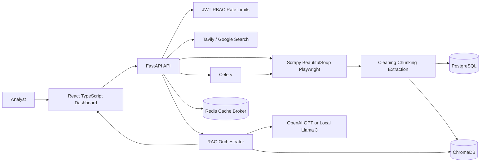
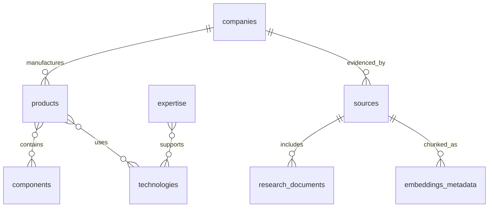

# Wireless Communication Intelligence Platform

## Architecture Diagram



## Folder Structure

```text
backend/              FastAPI, SQLAlchemy, LangChain, Celery, crawler services
frontend/             React, TypeScript, TailwindCSS dashboard
backend/schema.sql    PostgreSQL schema with keys and indexes
infra/k8s/            Raw Kubernetes deployment manifests
infra/helm/           Helm chart for cloud deployment
docs/                 Architecture, API, RAG, and roadmap notes
```

## API Specifications

| Method | Path | Purpose |
| --- | --- | --- |
| POST | `/api/v1/search` | Search internet sources and optionally persist source records |
| POST | `/api/v1/crawl` | Crawl URLs with HTTP or Playwright rendering |
| POST | `/api/v1/ingest` | Chunk source text and store embeddings in ChromaDB |
| POST | `/api/v1/chat` | Retrieve relevant chunks and generate source-backed answers |
| GET | `/api/v1/companies` | List extracted wireless companies |
| GET | `/api/v1/components` | List components such as antennas, gateways, modems |
| GET | `/api/v1/technologies` | List 4G, 5G, 6G, IoT, RF technologies |
| GET | `/api/v1/expertise` | List expertise taxonomy terms |
| GET | `/api/v1/analytics` | Dashboard metrics, latest sources, AI usage placeholders |

## AI Pipeline

1. Web search collects candidate URLs.
2. Crawlers fetch static or JavaScript-rendered pages.
3. BeautifulSoup cleans boilerplate and extracts readable text.
4. Text is chunked with overlap for retrieval stability.
5. ChromaDB stores embeddings and chunk metadata.
6. Extraction identifies companies, products, technologies, components, expertise, and locations.
7. Classification assigns company categories.
8. PostgreSQL stores normalized entities and relationships.
9. RAG retrieves top chunks, prompts OpenAI GPT or local Llama 3, and returns source URLs plus confidence.

## Knowledge Graph Schema



## Infrastructure Design

Local development runs with Docker Compose: PostgreSQL, Redis, ChromaDB, FastAPI, Celery worker, and Nginx-hosted React. Production deploys the API, worker, and frontend as independently scalable Kubernetes deployments. Secrets should be replaced with a cloud secret manager such as AWS Secrets Manager, GCP Secret Manager, Azure Key Vault, or External Secrets Operator.

## Development Roadmap

1. Add Alembic migrations and seed taxonomies for RF, 4G, 5G, 6G, IoT, satellite, and security.
2. Replace heuristic extraction with spaCy or GLiNER plus LLM-assisted structured extraction.
3. Add search provider adapters for Tavily and Google Custom Search with result deduplication.
4. Add organization-level tenancy, audit logs, and per-role dashboard permissions.
5. Add observability with OpenTelemetry, Prometheus metrics, and structured logs.
6. Add evaluation datasets for retrieval precision, answer groundedness, and entity extraction quality.
